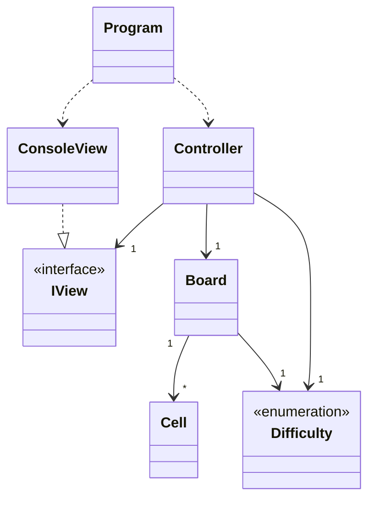

# Blackout

> Final Project — Programming Languages I, 2025/2026  
> Bachelor's in Video Games — Universidade Lusófona

## Authors and Division of Work
| Student | Contribution |
|---------|-------------|
| Daniel Henriques | Model (`Board`, `Cell`), `GameController`|
| Kirin Ota | View (`ConsoleView`, `IView`), `Program.cs`, `Difficulty.cs`, README, UML diagram | 

## Git Repository

[Link to repository](https://github.com/kirinlyraotawork-ai/ProjectLP1)

---

## Game Description

**Blackout** is a console puzzle played on a square grid. The goal is to turn off all cells. When a cell is selected, its state and the state of its adjacent cells (above, below, left, right) are toggled. The game starts with a solvable configuration generated by random clicks on an empty grid.

---

## UML Class Diagram

---

## References and Libraries

| Resource | Usage |
|----------|-------|
| [Spectre.Console](https://spectreconsole.net/) | User interface ([FigletText](), [prompt](https://spectreconsole.net/console/how-to/prompting-for-user-input), [panel](https://spectreconsole.net/console/widgets/panel), [markup](https://spectreconsole.net/console/reference/markup-referencev)) |
| [Official C# / .NET 10 documentation](https://learn.microsoft.com/en-us/dotnet/csharp/language-reference) | [value tuples](https://learn.microsoft.com/en-us/dotnet/csharp/language-reference/builtin-types/value-tuples) |
|[w3schools](https://www.w3schools.com)| [multidimensional arrays](https://www.w3schools.com/cs/cs_arrays_multi.php), [Type Casting](https://www.w3schools.com/cs/cs_type_casting.php)|