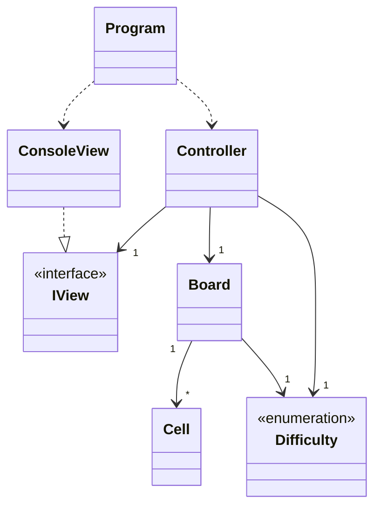

# Blackout

> Final Project — Programming Languages I, 2025/2026  
> Bachelor's in Video Games — Universidade Lusófona

## Authors and Division of Work
| Student | Contribution |
|---------|-------------|
| Daniel Henriques | Model (`Board`, `Cell`), `GameController`|
| Kirin Ota | View (`ConsoleView`, `IView`), `Program.cs`, `Difficulty.cs`, README, UML diagram | 

## Git Repository

[Link to repository](https://github.com/kirinlyraotawork-ai/ProjectLP1)

---

## Game Description

**Blackout** is a console puzzle played on a square grid. The goal is to turn off all cells. When a cell is selected, its state and the state of its adjacent cells (above, below, left, right) are toggled. The game starts with a solvable configuration generated by random clicks on an empty grid.

---

## Architecture

The project follows the **MVC (Model-View-Controller)** pattern, separating the code into three distinct layers:

- **Model** (`Board`, `Cell`, `Difficulty`): Contains all game logic and state. Has no knowledge of the UI whatsoever — it only manages *data* and *rules*.
- **View** (`IView`, `ConsoleView`): Responsible exclusively for rendering the game to the console and reading player input. The `IView` interface ensures the controller stays decoupled from the concrete view implementation.
- **Controller** (`Controller`): Contains the game loop and coordinates the model and view. It reacts to player input and updates the *model* accordingly.

## Algorithms

#### Board Initialisation

First of all, all cells are set to *OFF*. A number of *Random* clicks are applied to the grid: 5 if level the chosen level is easy, 10 for medium and 20 for the hardest level, The clicks use the exact same *toggle* logic as the player click, so it means the board is always solveable.

#### Clicking a Cell

When the player selects a cell at position *(row, col)*, that cell and its 4 adjacent neighbours (above, below, left, right) are toggled. Before toggling each neighbour, a *bounds check* ensures the coordinates are within the grid — this prevents crashes on edge and corner cells which have fewer than 4 neighbours.

#### Win Condition

After every click, the board scans every cell. If any cell is still *ON*, the game continues. Only when all cells are *OFF* does the game end and the victory screen appear.

#### Input Validation
The player's input is read as a string, then trimmed of whitespace. It is then split on spaces and each part is parsed as an integer using*int.TryParse*, (which handles non-numeric input safely without throwing exceptions.) Both numbers are checked if they are within the valid grid range before being accepted.
Lastly, if the player types *Quit*, the method returns *(-1,-1)* as a signal for the controller to return to the main menu.

---

## UML Class Diagram

---

## References and Libraries

| Resource | Usage |
|----------|-------|
| [Spectre.Console](https://spectreconsole.net/) | User interface ([FigletText](), [prompt](https://spectreconsole.net/console/how-to/prompting-for-user-input), [panel](https://spectreconsole.net/console/widgets/panel), [markup](https://spectreconsole.net/console/reference/markup-referencev)) |
| [Official C# / .NET 10 documentation](https://learn.microsoft.com/en-us/dotnet/csharp/language-reference) | [value tuples](https://learn.microsoft.com/en-us/dotnet/csharp/language-reference/builtin-types/value-tuples) |
|[w3schools](https://www.w3schools.com)| [multidimensional arrays](https://www.w3schools.com/cs/cs_arrays_multi.php), [Type Casting](https://www.w3schools.com/cs/cs_type_casting.php)|